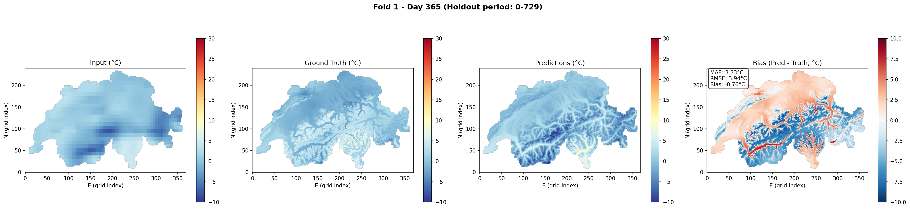
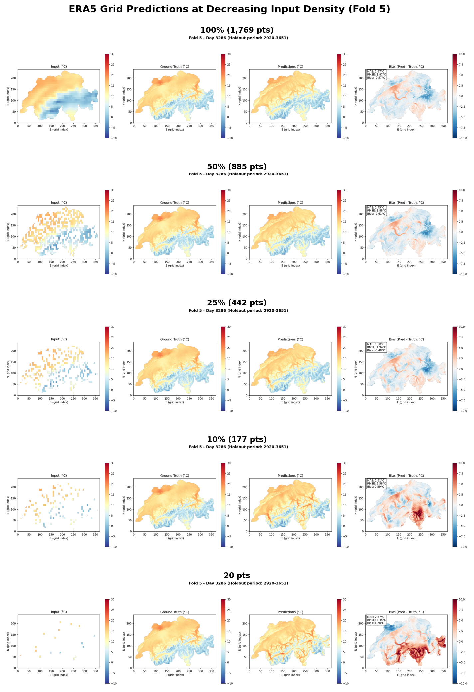

# ConvCNP for Climate Downscaling over Switzerland

Convolutional Conditional Neural Processes (ConvCNPs) for statistical downscaling of 2-meter temperature from coarse ERA5-Land reanalysis (~11 km) to fine-resolution MeteoSwiss ground truth over Switzerland. Built upon [Vaughan et al. (2022)](https://gmd.copernicus.org/preprints/gmd-2020-420/).

This project was conducted during the 2025/26 Fall semester as a capstone project for a Diploma in Advanced Studies at ETH Zürich, under the expert supervision of Dr. Christian Donner from the Swiss Data Science Center. Read the [full report](report.pdf) with in-depth analysis, reproducibility guidance and instructions on how to expand the models.

## Downscaling in Practice

The model takes a coarse ERA5-Land temperature grid as input and produces high-resolution predictions that resolve Alpine valleys, ridges, and plateaus invisible at the input resolution:



*Left to right: coarse ERA5 input, MeteoSwiss ground truth, ConvCNP prediction, and prediction bias. The model recovers fine-scale spatial structure driven by topography.*

## Robustness to Sparse Input

A key practical question is how the model performs when input data is incomplete. The ConvCNP degrades gracefully, maintaining recognizable predictions even with as few as 20 context points (down from ~1,800):



## How It Works

The ConvCNP operates in three stages:

1. **Encode** — context observations are mapped onto a discretized grid via a set convolution with RBF kernels
2. **Process** — a CNN refines the gridded representation, learning translation-equivariant spatial patterns
3. **Decode** — an elevation-aware MLP maps the learned features plus local topography (elevation, TPI) to Gaussian distribution parameters (mean + uncertainty) at each target location

Training uses 5-fold cross-validation over 10 years of daily data (2014-2023), with each fold holding out a contiguous ~2-year period.

### Key Results

| Metric | Value |
|--------|-------|
| MAE | 1.31 °C |
| CRPS Skill (vs. ERA5 interpolation) | 0.524 |
| Training | 30 epochs, 5-fold CV |

## Project Structure

```
convNPClimate/
├── convCNP/                  # Core ConvCNP architecture (Vaughan et al.)
├── datasets/                 # Data loading and preprocessing
├── trained_models/           # Trained checkpoints, metrics, and plots
├── training_notebook.ipynb   # Training pipeline
├── predictions.ipynb         # Inference, evaluation, and visualization
├── sparse-input-analysis.ipynb
├── visualization.py          # Plotting utilities
├── datasets.py               # Data loading, normalization, coordinate transforms
├── inference.py              # Prediction generation
├── model_factory.py          # Model construction
├── params.py                 # Configuration
└── metrics.py                # Evaluation metrics (MAE, RMSE, CRPS, skill)
```

## Getting Started

The two main entry points are:

- **[training_notebook.ipynb](training_notebook.ipynb)** — end-to-end training with configurable parameters, 5-fold CV, and checkpoint management
- **[predictions.ipynb](predictions.ipynb)** — load trained models, generate predictions, and produce evaluation plots

Pre-trained models are available under `trained_models/`.

## Primary References

- Vaughan, A. et al. (2022). *Convolutional conditional neural processes for local climate downscaling.* Geoscientific Model Development. [Paper](https://gmd.copernicus.org/preprints/gmd-2020-420/)
- Neural process encoder/decoder components adapted from [Yann Dubois](https://yanndubs.github.io)
